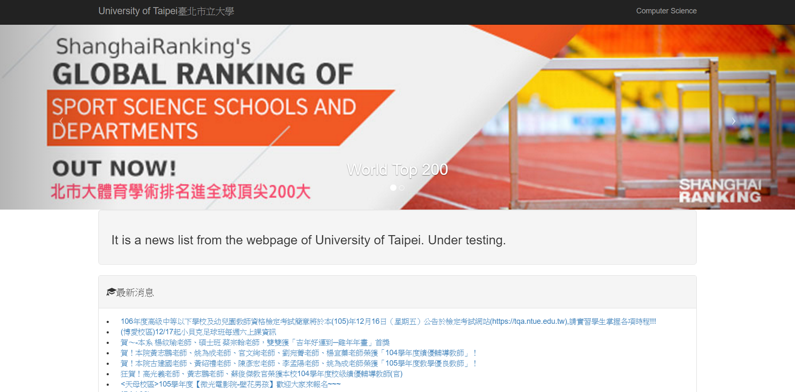

#2016-Utaipei_News
This is a project trying to get news from the index of University of Taipei and to redisplay in own style.
--------------------------------------------------
Requirements:
Python3.5
Django 1.10.4
Pip 9.0.1
Virtualenv 15.1.0
Beautifulsoup4 4.5.1
---------------------------------------------------------------------------------------------
Need to set up Virtualenv and Django first. The project is based on Django.
If you do not know how to set up, please see it [Django Tutorial](http://daikeren.github.io/django_tutorial/)

The system screenshot:

Desktop:

Mobile:

